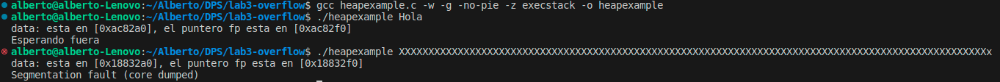

# Heap Overflow

Alberto Miguel Diez - amigud00@estudiantes.unileon.es

## 1. Compilación del programa

Para compilar el programa se debe utiliar el siguiente comando:

```bash
gcc heapexample.c -w -g -no-pie -z execstack -o heapexample
```

En la siguiente imagen se puede comprobar la ejecución del programa con algunos argumentos. Se puede ver que la segunda ejecución da _Segmentation fault (core dumped)_ pues se pasan 101 caracteres cuando el buffer solo puede almacenar 64. Esto significa que no se controla la entrada en el código.


